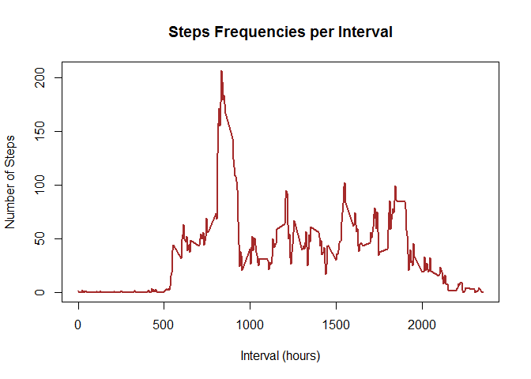

# Reproducible Research: Peer Assessment 1


This report is  part of the  project 1 of the Data Science Specializatino course, Reproducible Research. The data analyzed in this project originals from a personal activity monitoring device, which collects 5-minute intervals throughout a day. The dataset contains two months (i.e. October and November), and it includes the number of steps that each individual took every 5-minute interval each day. This report was created in RStudio with the aid of the knitr package.  


The activity.csv file is loaded from the archive into which it was extracted

```r
activity <- read.csv(file="C:/Users/Felix/Dropbox/Coursera/Data_Science_Specialization/activity.csv")
```


To transform the date field from factor to date

```r
activity$date <-as.Date (activity$date)
```


Load the reshape2 package 

```r
library(reshape2)
```


1) To answer the question, "What is the Mean Total Steps per Day", the data frame was Melted by date, and then Cast. In the Melt process, date variable (formerly id) and steps variable (formerly measure variable) yield a table of steps for each day. By Casting steps per date, we get a table of 3 columns and 61 rowns.

```r
actvMeltDate <- melt(activity, id.vars="date", measure.vars="steps", na.rm=FALSE)

actvCastDate <- dcast(actvMeltDate, date ~ variable, sum)
```


Plot the Histogram of the table created above: Steps per Day

```r
plot(actvCastDate$date, actvCastDate$steps, type="h", main="Histogram of Steps Per Day", xlab="Date", ylab="Steps per Day", col="brown", lwd=7)
```

\


Calculate the Mean steps per day

```r
mean(actvCastDate$steps, na.rm = TRUE)
```

```
## [1] 10766.19
```


Calculate the Median steps per day

```r
median(actvCastDate$steps, na.rm = TRUE)
```

```
## [1] 10765
```


2) To answer the question, "What is the daily average activity," the data frame was Melted and Cast as before with the exception that it was processed by the mean of intervals. In addition, the missing values are removed. 

```r
actvMeltInt <-melt(activity, id.vars="interval", measure.vars="steps", na.rm=TRUE)


actvCastInt <- dcast(actvMeltInt, interval ~ variable, mean)
```


Plot a time series graph of the "Steps' Frequencie per Interval"

```r
plot(actvCastInt$interval, actvCastInt$steps, type="l", main="Steps Frequencies per Interval", xlab="Interval (hours)", ylab="Number of Steps", col="brown", lwd=2)
```

\


To find the interval with the highest value

```r
actvCastInt$interval[which(actvCastInt$steps == max(actvCastInt$steps))]
```

```
## [1] 835
```


To find the highest mean steps

```r
max(actvCastInt$steps)
```

```
## [1] 206.1698
```


3) To answer question #1, but in the absence of mission values, a) first missing values will be calculated, b) then removed, c)Melt and Cast the new data frame for daily steps, and d) plot the histogram  

Calculate the total number of NAs in the dataset

```r
sum(is.na(activity$steps))
```

```
## [1] 2304
```


Missing values were removed by a) first renaming the actvCastInt dataframe (to avoid confusion), b) renaming the original data frame to a new name (activityWoNa), c) merging the two renamed data frames by intervals, d) and removing the missing values

```r
activityInt <-actvCastInt

activityWoNa <- activity

activityMerged = merge(activityWoNa, activityInt, by="interval", suffixes=c(".act", ".spi"))

indexNA = which(is.na(activityWoNa$steps))

activityWoNa[indexNA, "steps"] = activityMerged [indexNA, "steps.spi"]
```


Plot the Histogram of the data frame without missing values

```r
activityMeltWoNA <- melt(activityWoNa, id.vars="date", measure.vars="steps", na.rm=FALSE)

activityCastWoNa <- dcast(activityMeltWoNA, date ~ variable, sum)

plot(activityCastWoNa$date, activityCastWoNa$steps, type="h", main="Histogram of Steps Per Day", xlab="Date", ylab="Steps per Day", col="brown", lwd=7)
```

\

Calculate the mean steps per day after removing the missing values

```r
mean(activityCastWoNa$steps, na.rm=TRUE)
```

```
## [1] 10889.8
```

Calculate the median steps per day after removing the missing values

```r
median(activityCastWoNa$steps, na.rm=TRUE)
```

```
## [1] 11015
```


4) To determine if there are different patterns of activity between Weekdays and Weekdend, a) first a function was create to call a day as weekday or weekend, b) subset the data frames by weekday and weekend, c) melt and cast for intervals, and d) prepare  time series plots to compare the activities between weekday and weekend

```r
is_weekday <- function(d) {
    wkd <- weekdays(d)
    ifelse (wkd == "Saturday" | wkd == "Sunday", "weekend", "weekday")
}


wkday <-sapply (activityWoNa$date, is_weekday)
activityWoNa$wkd <- as.factor (wkday)
```


Subset the data frame by weekday and weekend. Melt and Cast each subset for intervals prior to preparing a time series plot

```r
actWkday <- subset(activityWoNa, wkd=="weekday")
actWkend <- subset (activityWoNa, wkd=="weekend")

actWkdayMelt <- melt (actWkday, id.vars = "interval", measure.vars = "steps")

actWkendMelt <- melt (actWkend, id.vars = "interval", measure.vars = "steps")

actWkdayCast <- dcast (actWkdayMelt, interval ~ variable, mean)
actWkendCast <- dcast (actWkendMelt, interval ~ variable, mean)
```


Load the packages ggplot2 and gridExtra

```r
library(ggplot2)
library(gridExtra)
```


Prepare two plots: one for weekday and the other for weekday, and print both plots

```r
PlotOne <- qplot(actWkdayCast$interval, actWkdayCast$steps, geom="line", data=actWkdayCast, main="Steps per Interval (Weekday)", xlab="Interval", ylab="Number of Steps")

PlotTwo <- qplot(actWkendCast$interval, actWkendCast$steps, geom="line", data=actWkendCast, main="Steps per Interval (weekend)", xlab="Interval", ylab="Number of Steps")

grid.arrange(PlotOne, PlotTwo, nrow=2)
```

\

